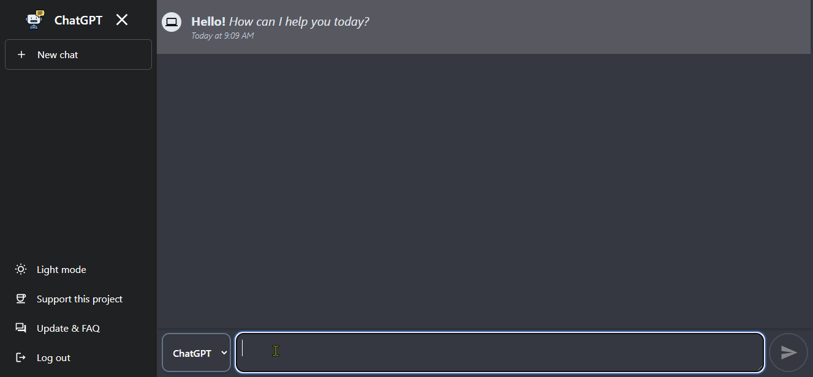

# ChatGPT clone with DALL.E image generation model

## One-Click Deploy

### Deploy to Netlify

[](https://app.netlify.com/start/deploy?repository=https://github.com/aiexpert-79/chatbot-react-web)

### Deploy to Vercel

[](https://vercel.com/new/clone?repository-url=https://github.com/aiexpert-79/chatbot-react-web&project-name=chatgpt-and-dalle&repo-name=chatbot-react-web)

> a demo of the App



**Give it a ⭐ if you liked it 😜**

## install

```bash
npm i
```

## start app

```bash
npm start
```

**_Tech used_**

- openai API
- react
- tailwindcss
- react-icons
- react-markdown

## 📝 License © [Honey](https://linkedin.com/au/honey Moharry)

> This project is released under the Apache License 2.0 license. See [LICENSE](./LICENSE) for details.
